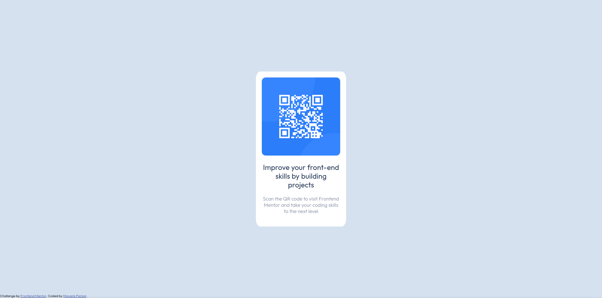

# Frontend Mentor - QR code component solution

This is a solution to the [QR code component challenge on Frontend Mentor](https://www.frontendmentor.io/challenges/qr-code-component-iux_sIO_H). Frontend Mentor challenges help you improve your coding skills by building realistic projects. 

## Table of contents

- [Overview](#overview)
  - [Screenshot](#screenshot)
  - [Links](#links)
- [My process](#my-process)
  - [Built with](#built-with)
  - [What I learned](#what-i-learned)
  - [Continued development](#continued-development)
  - [Useful resources](#useful-resources)
- [Author](#author)

## Overview

### Screenshot

### Links

- Solution URL: [Solution here](https://github.com/MayankParkar/QRCode)
- Live Site URL: [Live site here](https://mayankparkar.github.io/QRCode/)

## My process

### Built with

- Semantic HTML5 markup
- CSS custom properties
- Flexbox
- CSS

### What I learned

Through this project I have learned how to use CSS to design images and text, how to align all the elements according to desktop and mobile version of the website and learned about new HTML tags and CSS stylings.

### Continued development

I want to continue my Front end development skills further by doing these projects and wanted to refine and perfect my skills in the near future.

### Useful resources

- [Adding Custom Font](https://www.youtube.com/watch?v=qgmLDPLApBY) - This helped me to add custom Fonts in my project. I really liked this pattern and will use it going forward.

## Author

- LinkedIn - [Mayank Parkar](https://www.linkedin.com/in/mayank-parkar-09b2b5233/)
- Twitter - [@mayank_parkar](https://twitter.com/mayank_parkar)

